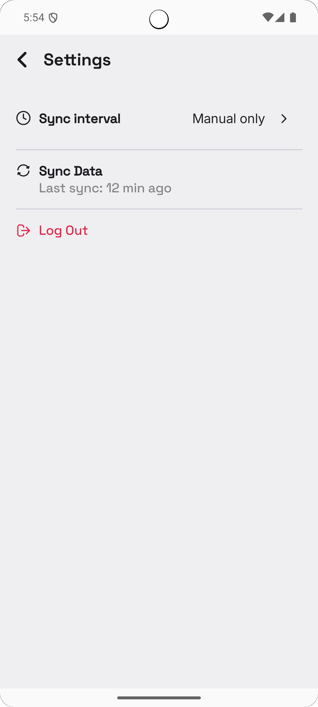

# NoteMark app

## Features
* Login and Registration using OAuth
* Local Database
* Responsive Design (supports portrait and landscape)
* Supports both phone and tablet layouts
* Manual Remote Sync
* WorkManager Syncs
* Clean Architecture

## Screenshots

<p style='padding: 20px;' float="left">
    
    
    
    
    
    
</p>

### Notes
* You have to add `INTERNET` permissions in order to make API calls.
* You can use 'Image Asset Studio' inside of Android Studio to create all of the app icons you need.
  * I just used my splash image as a starting point. 
    * See notes on creating the splash image [here](https://github.com/joshayoung/android-kotlin-app-training/blob/main/README.md)
* **If you want the top bar of the app to display correctly, `enableEdgeToEdge()` needs to be called below the splash screen code in your `MainActivity`!**
* If you have a domain layer, then never directly reference your data source (local or remote) in our view models. Any call to either of these data sources should go through either a repository or a use-case.
* If a `Serializable` class has a nullable field, it has to have a default value of `null` or the serialization will throw an exception (i.e. `var username: String? = null`).

### Add Test
* Select class name and press `ALT` + `ENTER`.

### Pre-Commit Hook for Linting
* `.git/hooks/pre-commit`
* ```bash
    #!/bin/bash

    ./gradlew ktlintFormat

    if [ $? -ne 0 ]; then
    echo "Fix the linting issues first!"
    exit 1
    fi

    echo "Ktlint check passed!"
     ```
  
### EdgeToEdge
* Use this: `statusBarStyle = SystemBarStyle.dark(0)` to set the status bar icons to light.
* ```kotlin
          enableEdgeToEdge(
             statusBarStyle = SystemBarStyle.dark(0)
        )
     ```

### To Do
* Rename remoteId to something more generic because this value is use locally as well.
* Change the status bar color and icons color for the login page only.
* Test Work Manager
* Switch to encrypted Data Store
* Work on Nav flash

### Ktlint
* `./gradlew ktlintCheck` - generate reports
* `./gradlew ktlintFormat` - format code

### Sync Notes
* Populate the local data source with the network data source
* Last-write wins

### Questions
* If I close the app from the note page, how do i make sure I update the sync queue?

### Open Local Database
* View -> Tool Windows -> App Inspector
* It seems you need to be in `Run` mode in Android Studio for the database inspector to work correctly (update the data, etc).

### NoteMark Resources
* https://jwt.io/
* https://icon.kitchen
* https://www.youtube.com/watch?v=MiLN2vs2Oe0
* https://www.youtube.com/watch?v=Z1WoLYF-b14
* https://www.youtube.com/watch?v=TosPS55y_IY
  * good architecture video
* https://developer.android.com/studio/write/create-app-icons
* https://www.guidgenerator.com
* https://timestampgenerator.com/1753546625/+00:00
* https://www.youtube.com/watch?v=McnVx7l5awk
* JSON to Data Class Plugin: https://plugins.jetbrains.com/plugin/9960-json-to-kotlin-class-jsontokotlinclass-
* https://www.youtube.com/watch?v=fSB6_KE95bU
* https://developer.android.com/topic/architecture/recommendations
* [Jetpack Compose previews for edge-to-edge design](https://medium.com/@timo_86166/jetpack-compose-previews-for-edge-to-edge-design-a03b3a3713f3)
* https://dev.to/theplebdev/android-notes-understanding-viewmodelscopelaunch-230f
* [Navigation in ViewModels](https://www.youtube.com/watch?v=BFhVvAzC52w)
* [Passing Data Back](https://www.youtube.com/watch?v=NhoV78E6yWo)
* [The Full Jetpack Compose Responsive UI Crash Course](https://www.youtube.com/watch?v=jU_BAQI4DiM)
* [Theming](https://www.youtube.com/watch?v=SH7HzLUjyBs)
* [Setup WorkManager with Koin](https://insert-koin.io/docs/reference/koin-android/workmanager/)
* [Use String Resources in VM](https://www.youtube.com/watch?v=mB1Lej0aDus)